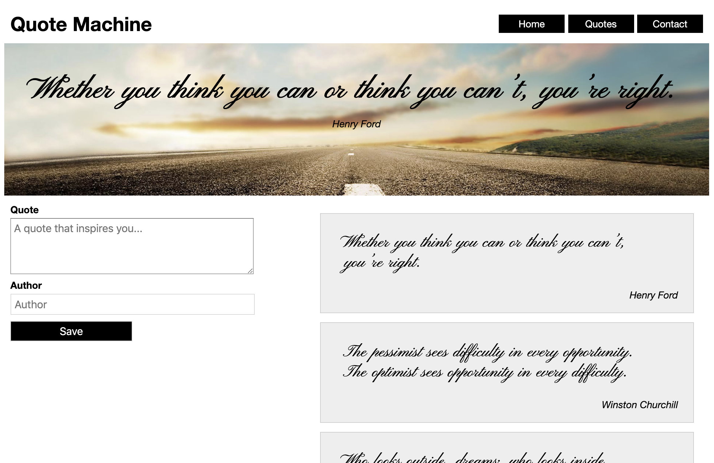

# Quote Machine

### Prerequisites

Students should be comfortable with:

- DOM manipulation
- Working with events and event handlers

### Demo

A working version of this code can be seen here: 
https://pages.git.generalassemb.ly/dang/lab-jsdom-quote-machine/solution/



## Exercise

Let's apply what we learned in class to make the Quote Machine website more interactive. The HTML and CSS is already provided for you, we simply need to make updates to JavaScript file provided. 

## Tasks

1. Link the `main.js` JavaScript file to the HTML page with the `script` tag in the appropriate place. 

2. Add in an event handler to capture the form submission for when a user adds a new quote.

3. Prevent the form from submitting when a user submits the form with `preventDefault()` on the event object.

4. Obtain and store the values of the quote and author that the user entered into the variables `quoteTxt` and `author`.

5. Update the `blockquote` and `p` element in the `.hero` container with the quote and author the user entered.

6. When a user enters a new quote, it should appear in the list of quotes using `appendChild`.

7. On second thought, change the position of where the quote is inserted, place new quotes at the top of the list of quotes.

8. When a user successfully submits the form, the form contents should be reset to empty strings.

9. Update the HTML and remove the default quotes that appear in the HTML when the page first loads.

10. A user should be required to enter both a quote and an author when saving.

11. Use JavaScript to load the following quote data when the page first loads: 

```js
const defaultQuotes = [
    {
      "quote": "Whether you think you can or think you can’t, you’re right.",
      "author": "Henry Ford"
    },
    {
      "quote": "The pessimist sees difficulty in every opportunity. The optimist sees opportunity in every difficulty.",
      "author": "Winston Churchill"
    },
    {
      "quote": "Who looks outside, dreams; who looks inside, awakens.",
      "author": "Carl Jung"
    },
    {
      "quote": "Darkness cannot drive out darkness, only light can do that. Hate cannot drive out hate, only love can do that.",
      "author": "Dr. Martin Luther King"
    }];
``` 

12. Make sure that every time a quote is added, it's also added to the `defaultQuotes` array. 

## Bonus 

Have the main quote at the top randomly pick a quote from the `defaultQuotes` array and display a new one every 5 seconds. 
